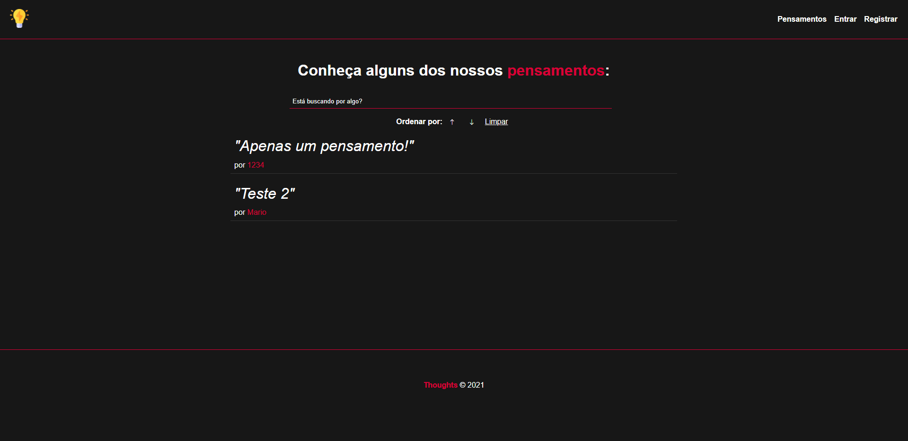
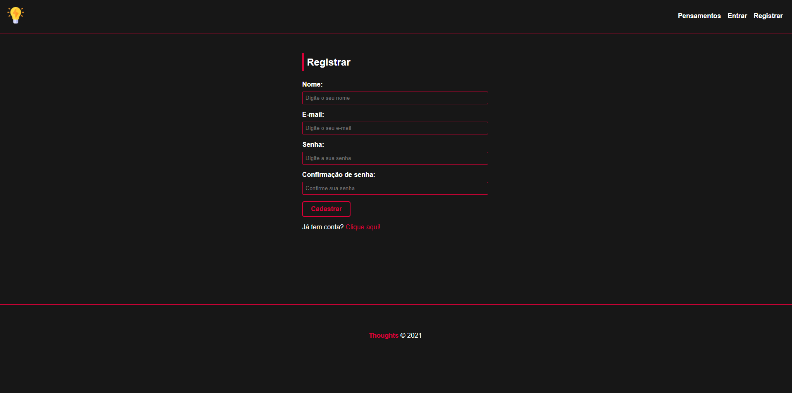
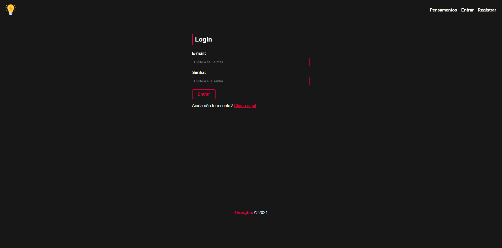
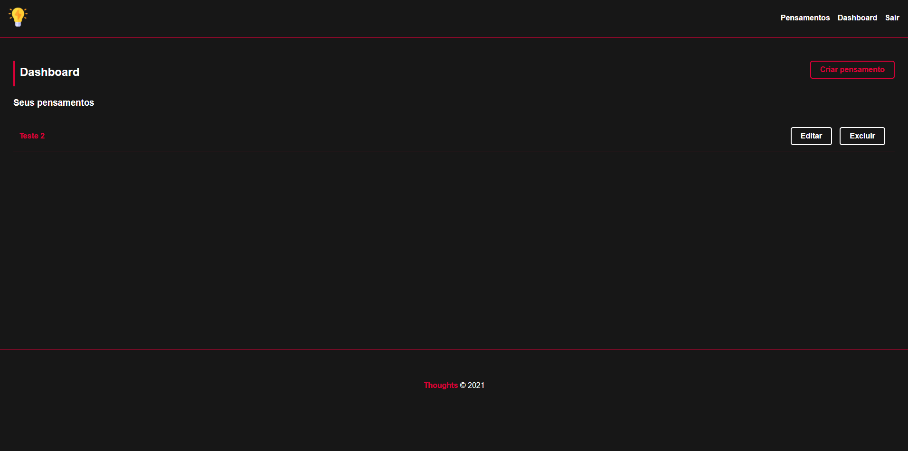
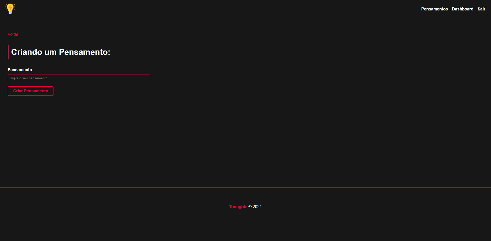
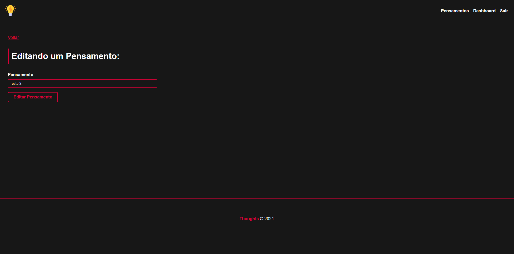

<h1 align="center">Thoughts</h1>

Sobre o projeto
=============

Thoughts é uma aplicação web para criação e visualização de pensamentos criados por usuários, podendo excluir ou editar os seus pensamentos criados.

Tecnologias utilizadas
-------------
- HTML
- CSS
- JS

Frameworks utilizado
-------------
- Express
- Sequelize
- MVC

Banco de dados utilizado
-------------
- MySQL

<h1 align="center">Tela principal (home)</h1>
Na tela principal você pode ver os pensamentos criados por outros usuários assim como filtrar por mais novo ou antigo e pesquisar por algum pensamento especifico.

<h1 align="center">Registrar</h1>

<h1 align="center">Login</h1>

<h1 align="center">Dashboard</h1>

<h1 align="center">Criar e editar um pensamento</h1>

